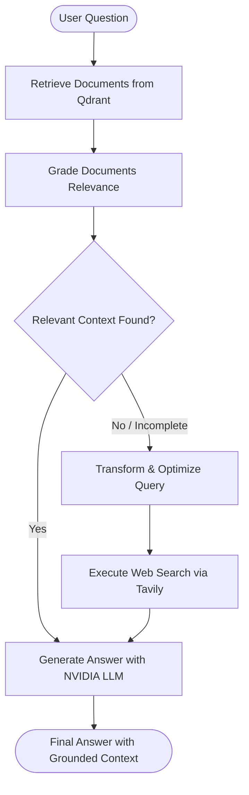

# 🔄 Corrective RAG (CRAG) Agent - Industry-Grade Architecture

An enterprise-grade, modular **Corrective Retrieval-Augmented Generation (CRAG)** agent built with **LangGraph**, **NVIDIA NIM Models**, **NVIDIA & Voyage AI Embeddings**, and **Qdrant Vector Database**, featuring a modern **HTML5, CSS3, and JavaScript** web user interface powered by a **FastAPI** backend.

---

## 🏛️ System Architecture

Corrective RAG enhances standard RAG workflows by evaluating the relevance of retrieved documents before generating responses. If the retrieved context is insufficient or off-topic, the system triggers a query transformation and falls back to live web search via Tavily.



---

## 📂 Project Structure

```text
Corrective_rag/
├── src/
│   ├── __init__.py
│   ├── config/
│   │   ├── __init__.py
│   │   └── settings.py          # Centralized Pydantic Settings & environment variables
│   ├── schemas/
│   │   ├── __init__.py
│   │   └── state.py             # TypedDict GraphState, DocumentGrade & Ingestion models
│   ├── utils/
│   │   ├── __init__.py
│   │   ├── logger.py            # Standardized application logging
│   │   └── exceptions.py        # Domain-specific exception hierarchy
│   ├── llm/
│   │   ├── __init__.py
│   │   └── client.py            # Factory for ChatNVIDIA & NVIDIAEmbeddings
│   ├── prompts/
│   │   ├── __init__.py
│   │   └── crag_prompts.py      # Grading, Query Optimization, and Generation prompts
│   ├── ingestion/
│   │   ├── __init__.py
│   │   ├── loaders.py           # Document loaders (PDF URL, Web HTML, Local Files)
│   │   └── splitters.py         # Recursive token-aware text splitters
│   ├── vectorstore/
│   │   ├── __init__.py
│   │   └── qdrant_store.py      # Qdrant client, dynamic vector dimensions & indexing
│   ├── tools/
│   │   ├── __init__.py
│   │   └── search.py            # Tavily search tool with retry backoff & formatting
│   ├── graph/
│   │   ├── __init__.py
│   │   ├── nodes.py             # Retrieve, Grade, TransformQuery, WebSearch, Generate nodes
│   │   ├── edges.py             # Conditional routing decisions
│   │   └── workflow.py          # StateGraph compilation & execution graph
│   └── service.py               # Unified CRAGService facade
├── ui/
│   ├── __init__.py
│   ├── server.py                # FastAPI REST & SSE streaming server
│   └── static/                  # Modern Web Frontend (HTML5, CSS3, JS)
│       ├── index.html           # Semantic responsive Single Page Application
│       ├── css/
│       │   └── styles.css       # Custom design system with glassmorphism & dark mode
│       └── js/
│           └── app.js           # Interactive state, SSE streaming, drag-and-drop & markdown
├── tests/
│   ├── __init__.py
│   ├── conftest.py              # Pytest fixtures & sample documents
│   ├── test_api.py              # FastAPI endpoints & static file serving tests
│   ├── test_config.py           # Configuration unit tests
│   ├── test_schemas.py          # Pydantic schema validation tests
│   ├── test_graph.py            # StateGraph routing & node execution tests
│   └── test_ingestion.py        # Chunking & ingestion tests
├── app.py                       # Main web server launcher (FastAPI + Uvicorn)
├── main.py                      # CLI tool for terminal & automated queries
├── corrective_rag.py            # Backward-compatible entrypoint
├── .env.example                 # Configuration environment template
├── requirements.txt             # Project dependencies
└── README.md                    # Project documentation
```

---

## ⚡ Quick Start

### 1. Installation

```bash
pip install -r requirements.txt
```

### 2. Environment Configuration

Copy the example configuration and fill in your API credentials:

```bash
cp .env.example .env
```

Edit `.env`:
```ini
NVIDIA_API_KEY=nvapi-your-key-here
TAVILY_API_KEY=tvly-your-key-here
QDRANT_URL=http://localhost:6333

# Chat Model (NVIDIA NIM)
NVIDIA_CHAT_MODEL=meta/llama-3.1-70b-instruct

# Embedding Provider (FastEmbed Local, NVIDIA NIM, or Voyage AI)
# Option 1: FastEmbed (100% free, local, no API keys or rate limits)
EMBEDDING_PROVIDER=fastembed
NVIDIA_EMBEDDING_MODEL=BAAI/bge-small-en-v1.5

# Option 2: NVIDIA NIM (Cloud)
# EMBEDDING_PROVIDER=nvidia
# NVIDIA_EMBEDDING_MODEL=nvidia/nemotron-3-embed-1b

# Option 3: Voyage AI (Cloud)
# EMBEDDING_PROVIDER=voyage
# VOYAGE_API_KEY=pa-your-voyage-api-key-here
# NVIDIA_EMBEDDING_MODEL=voyage-3
```

---

## 🚀 Running the Application

### Option A: Modern Web UI (HTML5 / CSS3 / JavaScript)

Launch the web application:

```bash
python app.py
```
Or with Uvicorn:
```bash
uvicorn ui.server:app --host 0.0.0.0 --port 8000 --reload
```

Open your browser and navigate to: **`http://localhost:8000`**

#### Key Frontend Features:
- **Configuration Drawer & Custom Model Selector**: Choose from presets or select **`✨ Custom Model ID...`** to input any NVIDIA NIM LLM (e.g., `meta/llama-3.1-405b-instruct`, `deepseek-ai/deepseek-r1`, `qwen/qwen2.5-72b-instruct`) and custom Embedding model (e.g., `nvidia/nv-embedqa-mistral-7b-v2`, `baai/bge-m3`, `snowflake/arctic-embed-l`).
- **Dynamic Dimension Detection**: Automatically computes embedding dimensions and manages Qdrant collection schemas dynamically for any custom embedding model.
- **Document Ingestion Hub**: Index documents by entering remote URLs (PDF, web articles) or dragging and dropping local `.pdf`, `.txt`, and `.md` files.
- **Visual LangGraph Pipeline Stepper**: Interactive visual execution graph tracking `Retrieve` ➔ `Grade Documents` ➔ `Transform Query` ➔ `Web Search` ➔ `Generate` in real time via Server-Sent Events (SSE).
- **Inspectable State Accordions**: Expand each execution node to view retrieved chunks, relevance grading metrics, query rewrites, and raw state JSON.
- **Rich Markdown Final Answer**: Formatted output with code blocks, tables, lists, and one-click copy to clipboard.
- **Dark / Light Theme Toggle**: Sleek glassmorphic theme with persistent preference.

---

### Option B: CLI Terminal Interface

```bash
# Ingest a document and query using Voyage AI embeddings directly from the terminal
python main.py \
  --url "https://arxiv.org/pdf/2307.09288.pdf" \
  --chat-model "meta/llama-3.1-70b-instruct" \
  --embed-model "voyage-3" \
  --voyage-api-key "pa-your-voyage-api-key-here" \
  --query "What are the fine-tuning methods used in Llama 2?"
```

---

## 🧪 Running Unit Tests

Run the full pytest suite (including unit tests for core modules, LangGraph flow, and FastAPI endpoints):

```bash
pytest tests/ -v
```
